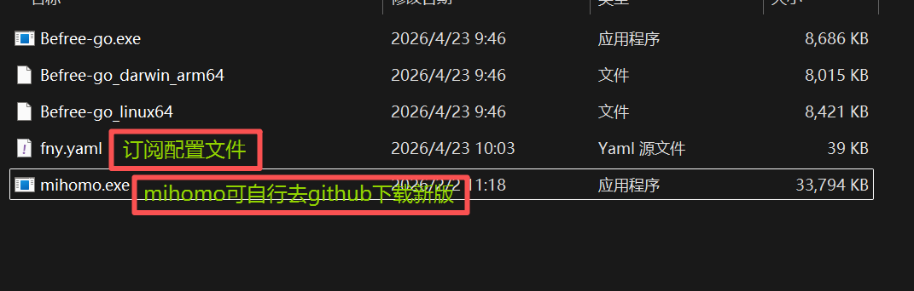
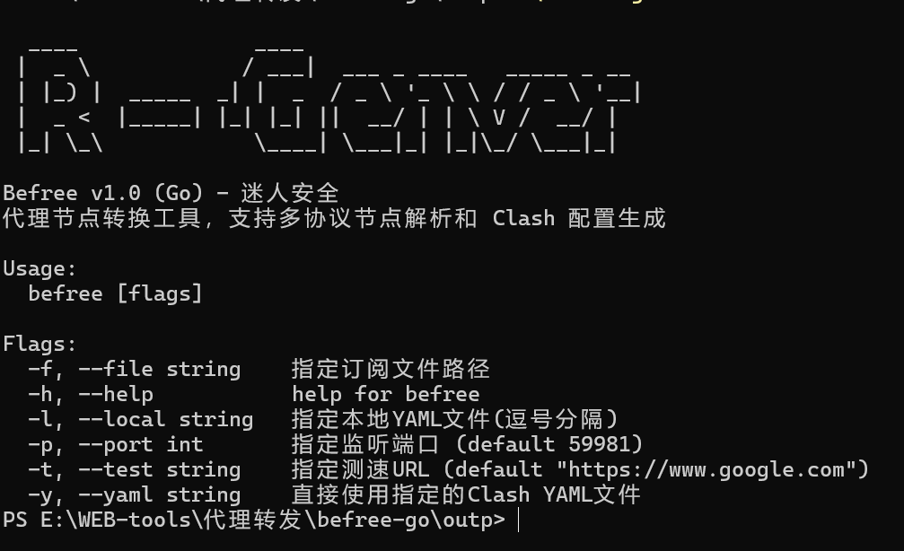
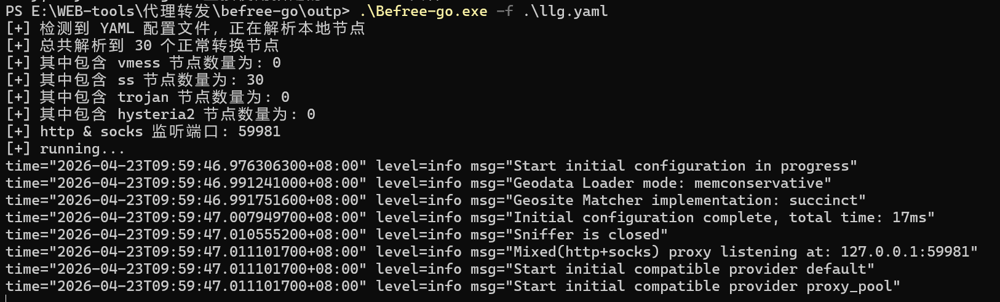
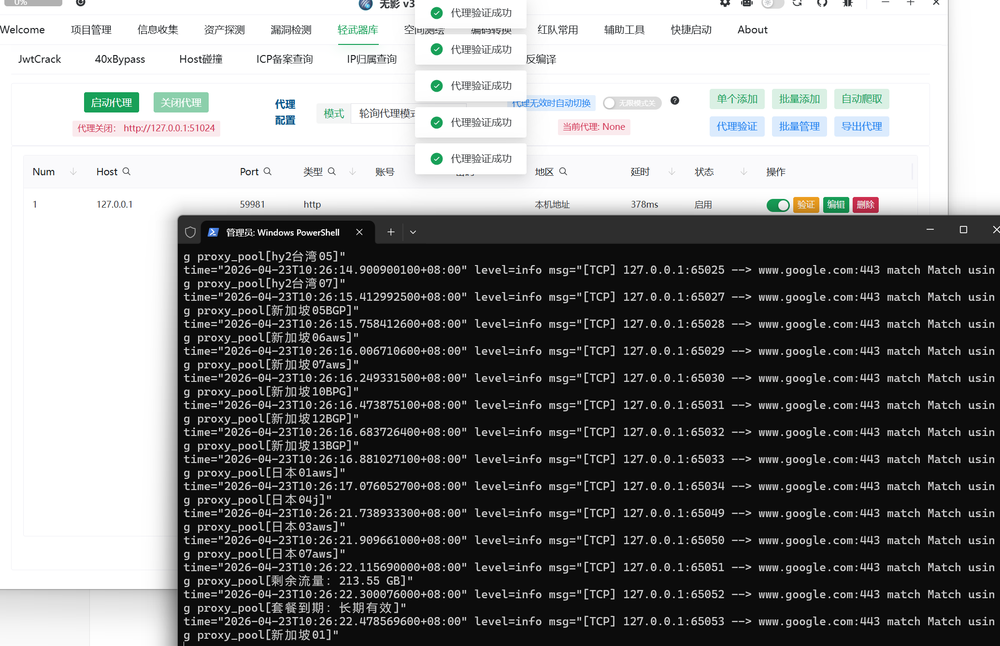
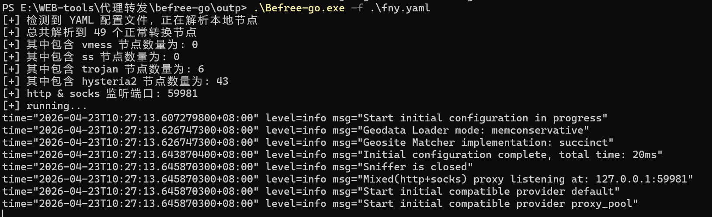

# Befree-go

一款通过轮询各类订阅中节点的代理池工具

看了v2rayN、sstap等工具之后，发现很多类似的工具基本都是套了个壳，最后还是调用clash、mihomo等代理工具。

于是为了操作方便以及代理池的需求，有了这款工具。通过解析订阅中各个节点，重新生成mihomo配置文件，调用mihomo，进行节点轮询，达到代理池的效果。

本来打算调用mihomo这部分也重新写一下，后来发现很多协议、很多加解密类型，太繁琐，造轮子有点麻烦，于是最后决定还是直接调用mihomo。

release中的文件包含了一个mihomo，如果怕存在后门，可以自行去下载[mihomo](https://github.com/MetaCubeX/mihomo/releases)。



## 更新记录

v1.0版本

- 更换语言为go，增强跨平台性

v0.5版本

- 替换内部的clash内核，更改为最新的mihomo
- 支持hysteria2协议

## 编码环境

go

## 利用方法

```text
  -h      查看帮助
  -f      指定一个包含订阅文件的路径
  -l      指定本地YAML文件(逗号分隔，例如:file1.yaml,file2.yaml)
  -p      指定端口号(http和socks5,默认59918)
  -t      指定一个用于速度测试的链接(默认:https://www.google.com)
  -y      指定一个自己的Clash Yaml文件
```

## 利用效果

#### 运行



#### 指定订阅文件，指定监听端口 查询节点



#### 目录扫描

调用tscan代理池进行验证效果



#### 指定自己的配置文件



## 当前支持协议

| 协议类型  | 是否支持               |
| --------- | ---------------------- |
| vmess     | 支持√                  |
| trojan    | 支持√                  |
| ss        | 支持√                  |
| ssr       | 解析存在问题，下次更新 |
| hysteria2 | 支持✅                  |

## 致谢

作者原地址：
https://github.com/zidanfanshao/befree
